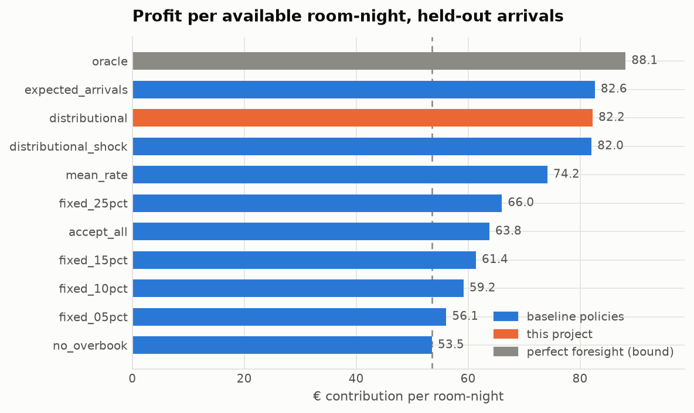
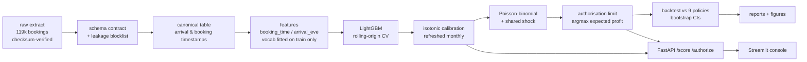

# overbook

**Hotels cancel-proof their revenue by selling rooms they don't have. This works out how many.**

A cancellation model is a forecasting problem. Deciding how many rooms to sell
is not — it is a decision under an asymmetric loss, and the two need different
machinery. This project builds both on 119,210 real hotel bookings, and
measures the decision in euros on arrivals the model has never seen.

```
119,210 real bookings  →  calibrated cancellation risk  →  a nightly authorisation limit  →  € measured on held-out nights
```

---

## The problem, in one picture

A hotel holding *n* bookings for one night earns margin on every room it
fills, up to capacity. Past capacity the curve does not flatten — it falls off
a cliff, because a guest with a confirmed booking and no room has to be paid
for, driven elsewhere, and apologised to.

```
profit(arrivals) = margin × min(arrivals, capacity) − walk_cost × max(arrivals − capacity, 0)
```

That kink is the whole problem. Under an asymmetric loss the right decision
depends on the **shape** of the arrival distribution, not just its mean — so
the project computes the distribution exactly (a Poisson-binomial over
per-booking show probabilities) rather than reasoning about an average.


*One real held-out night. 78 bookings on the books, 40 rooms. The policy
authorises 63 — 57% over capacity — accepting a 21% chance of overselling
because the expected cost of empty rooms exceeds it. Other rules stop
elsewhere; the curve shows what that costs.*

---

## Results

Held out: **2017-04-01 → 2017-08-31**, 306 hotel-nights across two properties,
arrivals never seen in training. Demand exceeds capacity on 40% of them.

| | cancellation model |
|---|---|
| ROC-AUC (test, raw / calibrated) | **0.889** / 0.888 |
| ROC-AUC (rolling-origin CV) | 0.906 ± 0.011 |
| Brier / ECE after calibration | **0.1355** / **0.041** |
| ECE with the calibrator refreshed monthly | **0.026** |

| policy | € / room-night | occupancy | guests walked per 100 nights | % of achievable gain |
|---|---|---|---|---|
| perfect foresight (bound) | 88.14 | 88.9% | 0.0 | 100% |
| **this project** | **82.05** | 83.8% | **27.5** | **82%** |
| same model, mean-based decision | 82.64 | 86.0% | 59.2 | 84% |
| pooled-rate rule *(industry standard)* | 74.17 | 79.2% | 105.9 | 60% |
| accept every booking | 63.79 | 88.9% | 552.3 | 30% |
| never overbook | 53.53 | 54.1% | 0.0 | 0% |

**Against the pooled-rate rule a hotel would actually use: +425 € per
hotel-night (95% CI +312 to +554, bootstrap over nights, P(positive) = 1.00) —
and a quarter of the walked guests.**



### The result that did not go my way

Against `expected_arrivals` — the **same model**, with the decision collapsed
to a mean instead of a distribution — this project is **−32 € per night
(95% CI −65 to +3)**. Slightly behind, at the default cost assumption.

I kept it in the headline because it is the most useful thing the backtest
says: **almost all of the gain comes from having calibrated per-booking
probabilities at all, not from the optimiser layered on top of them.** Anyone
claiming otherwise has not run the ablation.

What the distribution *does* buy is control. A mean-based rule has no
mechanism to care how expensive a walk is, so its walk rate is flat no matter
what you tell it:

| cost of a walk (× ADR) | 1.0 | 1.5 | 2.0 | 3.0 | 4.0 | 6.0 |
|---|---|---|---|---|---|---|
| walks per 100 nights — distributional | 45.4 | 33.7 | **27.5** | 22.5 | 19.0 | 16.0 |
| walks per 100 nights — mean-based | 59.2 | 59.2 | 59.2 | 59.2 | 59.2 | 59.2 |
| € uplift — distributional | 30.08 | 29.19 | 28.52 | 27.46 | **26.72** | **25.44** |
| € uplift — mean-based | 30.53 | 29.82 | 29.11 | 27.69 | 26.27 | 23.43 |

Above roughly 3× ADR — which is where a walk sits once you price the review,
the OTA rating and the lost repeat guest, not just the taxi — it wins on money
too.


### …and it only matters when rooms are scarce

Capacity is not in the dataset, so it is inferred and then **swept**. With
loose capacity every policy converges on "accept everything" and the decision
layer is theatre. As rooms get scarce the naive rules fall apart — accepting
everything goes **negative** — while the calibrated policies hold.


Full generated numbers: **[reports/RESULTS.md](reports/RESULTS.md)**.

---

## Two defects I found, and what I did about them

The first backtest lost to the naive rule. Rather than tune until it won, I
measured why. Both fixes use only past data, and both are in the pipeline.

**1. The calibrator goes stale.** Cancellations run at 33.5% in the
calibration window and 41.2% in the evaluation window, so a frozen map
under-predicts by about four points — and every under-prediction biases the
authorisation level. A hotel does not have this problem: by the time it sets
June's limits, April and May have resolved. `rolling_recalibrate` reproduces
that, refitting on strictly earlier arrival dates only. **ECE 0.041 → 0.026.**

**2. Bookings do not cancel independently.** The Poisson-binomial is exact
*given* independence. Measured on validation, night-level arrivals are about
**twice** as dispersed as independence implies (observed MSE 21.2 vs variance
8.1), because guests on one night share shocks the model cannot see. So the
exact PMF is kept and mixed over a shared multiplicative shock
`A | U ~ PoissonBinomial(sᵢ·U)`, with `τ = 0.070` estimated on validation and
frozen. That widening is what lets the policy respond to the walk cost at all.

---

## How it fits together



### Things that are easy to get wrong here, and how they're handled

**Leakage.** This dataset hands you three columns that produce a ~0.99 AUC
model worth nothing: `reservation_status` is the target respelled,
`reservation_status_date` is the cancellation date, and `assigned_room_type`
is assigned at check-in so a no-show can never have one. They are named once,
in [`data/schema.py`](src/overbook/data/schema.py), with the reason; the
feature builder calls `assert_no_leakage` **at runtime**, and
[`tests/test_leakage.py`](tests/test_leakage.py) proves it — including a test
that corrupts the future and asserts past features do not move.

**Two information sets, reported separately.** `booking_time` uses only what
was known when the reservation was made (AUC 0.885); `arrival_eve` adds what
accrued while it sat on the books (AUC 0.889). The overbooking decision lives
in the second, and saying which one a number came from is the difference
between an honest result and an accidental one.

**Forward-only validation.** Split on *arrival date*, never at random.
Hyperparameters come from rolling-origin CV inside the training window
([`scripts/tune_lightgbm.py`](scripts/tune_lightgbm.py)). Early stopping uses
the tail of the training window, because the validation window is reserved
**entirely** for calibration — otherwise the calibrator is fitted on data the
model already peeked at.

**Calibration as a first-class result.** The decision layer multiplies
probabilities by euros, so a well-*ranked* probability is not good enough.
Brier, ECE, MCE and aggregate bias are tracked per segment and per month. (AUC
moves 0.8893 → 0.8883 under isotonic: a step function maps distinct scores
onto equal ones, and those ties cost a sliver. Small, real, stated.)

**Uncertainty on the headline.** Bootstrap over *nights*, not bookings —
every booking on one night shares a single decision, so resampling bookings
would understate the interval.

**Assumptions swept, not asserted.** The dataset has no cost data and no room
inventory. The walk-cost multiplier, the variable-cost ratio and the capacity
quantile are config values, and `reports/sensitivity*.csv` sweeps all of them.

---

## Quickstart

```bash
make setup     # virtualenv + dependencies
make all       # download → clean → train → backtest → reports   (~40s, 4 cores)
make check     # ruff + 92 tests
```

Then:

```bash
make dashboard   # revenue-management console
make api         # FastAPI on :8000, interactive docs at /docs
```

```bash
curl -s localhost:8000/authorize -H 'content-type: application/json' -d '{
  "hotel": "City Hotel",
  "arrival_date": "2017-09-15",
  "capacity": 68,
  "bookings": [{"lead_time": 120, "adr": 110, "market_segment": "Groups"},
               {"lead_time": 3,   "adr": 180, "deposit_type": "No Deposit"}]
}'
```

Bookings are scored **as a set for one arrival date**, not one at a time —
several features describe a booking's position in that night's queue, so
scoring one in isolation would feed the model a night with a single
reservation on the books.

Docker: `docker build -t overbook . && docker run -p 8000:8000 overbook`
(the image trains the model during build, so the container starts ready).

---

## Layout

```
conf/config.yaml              every tunable that can change a reported number
src/overbook/
  data/     schema.py         the schema contract + the leakage blocklist
            clean.py          canonical table; reconstructs booking timestamps
  features/ build.py          leakage-safe features, two information sets
  models/   train.py          rolling-origin CV, the model ladder
            calibrate.py      isotonic + rolling recalibration
            evaluate.py       calibration-aware metrics
  decision/ poisson_binomial.py   exact arrival distribution
            overdispersion.py     the shared-shock correction
            policy.py             the policy ladder, from do-nothing to oracle
            backtest.py           replay + bootstrap
  monitoring/drift.py         PSI / KS, month-by-month calibration
  explain/  shap_report.py    global and per-booking drivers
  api/      main.py           FastAPI service
  dashboard/app.py            Streamlit console
scripts/tune_lightgbm.py      reproduces the hyperparameter block
tests/                        92 tests; the suite builds its own fixture data
reports/                      generated — RESULTS.md, CSVs, figures
```

---

## Limitations

Stated plainly, because a model used to sell rooms that don't exist should
come with them.

- **Single-night model.** Each arrival date is treated independently and the
  guest's whole stay is ignored, so euro figures are *per arrival-night* and
  understate full-stay economics. Length-of-stay coupling — a guest walked on
  night one is also gone on nights two and three — is the obvious next step.
- **No demand substitution.** A booking the policy declines is assumed simply
  not to happen: no rebooking on another date, no walk-in taking the room.
  This biases the comparison *against* aggressive policies, so it does not
  flatter the method.
- **Capacity is inferred, not observed.** It is a quantile of training
  arrivals, which sets how hard the problem is. The default (0.70, binding on
  40% of nights) is a deliberate choice of regime; `sensitivity_capacity.csv`
  reports 0.50 → 0.90.
- **Costs are assumptions.** No cost column exists. Margin = ADR × 0.75 and
  walk = ADR × 2.0 are inputs, swept in `sensitivity.csv`.
- **Two hotels, 2015–2017, Portugal.** Nothing here has been shown to
  transfer, and the calendar drift is severe: the top PSI values are
  `arrival_month` and `arrival_weekofyear`, which is an artifact of testing on
  April–August only, not a data defect — but the cancellation rate really does
  trend, which is why recalibration is in the loop.
- **`country` is the second-strongest feature.** It is almost certainly a
  proxy for channel, distance and price sensitivity. Using nationality to
  decide whose booking gets squeezed is a live fairness question, not a
  modelling detail; a production version should test whether dropping it costs
  anything (the ablation is easy — flip it out of `BASE_CATEGORICAL`).
- **Bookings are assumed conditionally independent given the shared shock.**
  The shock corrects the *magnitude* of the variance, not correlation
  structure between specific bookings (a tour operator's block cancels
  together).
- **~32k exact duplicate rows are kept** by default, on the grounds that group
  bookings legitimately produce identical rows. `data.drop_exact_duplicates`
  runs the alternative.

---

## Data

Hotel booking demand datasets, Antonio, de Almeida & Nunes, *Data in Brief*
22 (2019) 41–49, [doi:10.1016/j.dib.2018.11.126](https://doi.org/10.1016/j.dib.2018.11.126) —
two Portuguese hotels, arrivals July 2015 to August 2017, anonymised at
source. Fetched from the
[TidyTuesday](https://github.com/rfordatascience/tidytuesday/tree/main/data/2020/2020-02-11)
mirror and checksum-verified on download.

MIT licensed.
