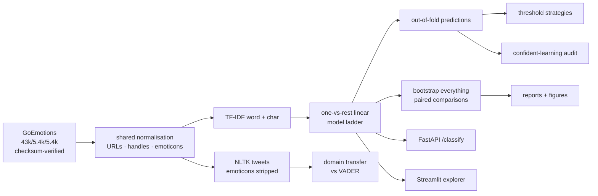

# nuance

**27 emotions, 43,410 Reddit comments, and a scoreboard that admits what it doesn't know.**

The headline number on this benchmark is macro-F1. Its rarest label has **six**
positive examples in the held-out set. This project builds the classifier, and
then spends most of its effort on the harder question: which of the numbers
everyone reports are measurements, and which are coin flips wearing four
decimal places.

---

## The finding

```
macro-F1 = 0.4721,  95% CI [0.4477, 0.4893]
                    └─────────── 0.041 wide ───────────┘
```

**The confidence interval is wider than the gap between the methods people rank
on this benchmark.** The dataset's authors report macro-F1 0.46 for a fine-tuned
BERT baseline. A TF-IDF linear model gets 0.4721, and the two sit comfortably
inside one interval — so the ranking between them is not evidence of anything.

That is not an argument that bag-of-words matches transformers. It is an
argument that **this test set cannot tell**, and that reporting a bare number
without its interval hides it.


Sorted by support. The intervals do not widen because the model gets worse —
they widen because there is nothing left to measure with. `grief` scores F1
0.500 on **six** examples, 95% CI **[0.000, 0.800]**.

---

## Four things that are usually done wrong

### 1. A single macro-F1 over labels that cannot be scored

23 of 28 labels clear 50 held-out positives. Restricted to those, macro-F1 is
**0.4973 [0.4856, 0.5086]** — higher *and* with an interval **1.8× tighter**.
The remaining five labels contribute mostly variance.

| | median interval width |
|---|---|
| labels with ≥50 held-out positives | 0.119 |
| labels below that | 0.330 |

### 2. Comparing models by their separate confidence intervals

Word-only scores 0.4504 [0.4272, 0.4687]; adding character n-grams gives
0.4721 [0.4477, 0.4893]. Those intervals overlap across most of their range,
which looks inconclusive — and isn't. Two systems scored on the *same*
comments share most of their noise, so the comparison must be **paired**:

| comparison | difference | 95% CI | verdict |
|---|---|---|---|
| char n-grams vs word only | **+0.0217** | [+0.0107, +0.0331] | real |
| logistic vs linear SVM | **+0.0213** | [+0.0034, +0.0410] | real |
| class weighting vs none | **+0.1164** | [+0.0927, +0.1382] | real |
| per-label thresholds vs flat 0.5 | −0.0089 | [−0.0257, +0.0060] | can't tell |

Pairing resolves a +0.022 difference that independent intervals call a wash.

### 3. Tuning thresholds, and tuning them on the wrong split

0.5 is not a neutral default — it is a fitted parameter that happens to have
been fitted by convention. The standard fix is a threshold per label, tuned on
the dev split. On this data **it makes things worse**: `grief` has thirteen dev
positives, and a threshold fitted on thirteen examples is noise.

Cross-fitting the same tuning on out-of-fold *training* predictions — where the
rare labels have several times more positives — repairs the damage, and still
buys nothing measurable.


The honest summary: on this benchmark threshold tuning is a coin flip dressed
as a method, and the version most people use lands on the wrong side of it.

### 4. Never leaving the training distribution

A sentiment model trained on Reddit, evaluated on tweets from July 2015:

| | Reddit (in-domain) | Twitter (out-of-domain) |
|---|---|---|
| wordchar logistic | **0.868** | **0.666** |
| VADER lexicon (no training) | 0.817 | 0.625 |
| majority class | 0.631 | 0.500 |

Twenty accuracy points, gone — more than every modelling decision in this
repository put together, and the trained model's edge over a zero-training
lexicon narrows from +5 points to +4.

**And there is a trap in that evaluation.** NLTK's tweet labels come from
emoticons that are *still in the text*: 97.8% of tweets are decidable from the
emoticon alone, at 100% accuracy where the rule fires. Skip the stripping step
and the same model reports 0.794 instead of 0.666 — a 13-point illusion, from
one preprocessing line.


---

## What the model actually gets wrong

| | share of substitution errors |
|---|---|
| stay inside the same Ekman family | 19.7% |
| involve `neutral` in one direction or the other | **49.2%** |

I expected the first number to be the large one — that the difficulty was a
taxonomy splitting hairs between `nervousness` and `fear`. It isn't. Half the
errors are the model and the annotators disagreeing about **whether a comment
carries any emotion at all**, which is the judgement humans disagree about most.

Scoring the *same predictions* against coarser taxonomies:

| taxonomy | labels | rarest label | macro-F1 |
|---|---|---|---|
| 27 emotions + neutral | 28 | 6 | 0.4721 |
| 6 Ekman families + neutral | 7 | 98 | 0.5765 |
| positive / negative / ambiguous / neutral | 4 | 677 | 0.6403 |

Nothing about the model changed. Only the question did — and only the coarser
questions have enough data behind every label to answer.

---

## Are the labels even right?

Confident learning ([Northcutt et al., JAIR 2021](https://arxiv.org/abs/1911.00068)),
implemented here rather than imported, on out-of-fold predictions:

| comment | annotated | flagged as missing |
|---|---|---|
| `FUCK YOU` | neutral | anger |
| `Why thank you` | curiosity | gratitude |
| `I'm so sorry` | sadness | remorse |
| `so proud of you!` | admiration | pride |

Some are plain errors; **43%** name an emotion in the same Ekman family as one
already assigned — a shade, not a mistake. Acting on the audit is a different
question from finding it: dropping every implicated row (14,685 comments, 34%
of the training set) and retraining moves macro-F1 from 0.4721 to 0.4736,
which is **not distinguishable from noise**. The audit earns its place by
finding labels worth fixing, not by moving the score.

---

## And more data would beat cleverer data


Uncertainty sampling is indistinguishable from labelling at random, and the
curve is still climbing at the full 43,410 comments. Reaching 95% of the
full-data score takes ~74% of the corpus either way.

Full generated numbers: **[reports/RESULTS.md](reports/RESULTS.md)**.

---

## How it fits together



**Bootstrapping everything is affordable because of one observation.** F1 depends
on the data only through per-label TP/FP/FN counts, and those counts are *linear
in the rows*. So a bootstrap resample is a weighted sum of per-row
contributions, and 2,000 resamples become a single matrix multiply instead of
2,000 passes over the data — about a second for the full test set. That is why
every number in this repository has an interval attached instead of just the
headline.

---

## Quickstart

```bash
make setup     # virtualenv + dependencies
make all       # download → train → audit → transfer → budget → reports  (~3 min, 4 cores)
make check     # ruff + 80 tests
```

```bash
make dashboard   # explorer: try text, browse the scoreboard and the flagged labels
make api         # FastAPI on :8000, docs at /docs
```

```bash
curl -s localhost:8000/classify -H 'content-type: application/json' \
  -d '{"texts": ["honestly did not expect this to work, but here we are"]}'
```

The service returns every label's score **with the threshold it was compared
against and the label's held-out support**, so a caller acting on `grief` can
see that the estimate behind it rests on six examples. `GET /labels` says which
labels are measurable at all.

Docker: `docker build -t nuance . && docker run -p 8000:8000 nuance`.

---

## Layout

```
conf/config.yaml               every tunable that can move a number
src/nuance/
  data/     taxonomy.py        27 emotions, 6 Ekman families, 4 sentiments
            goemotions.py      corpus loader + label matrix
            twitter.py         the transfer set, and the emoticon trap
  features/ text.py            normalisation shared by every corpus
  models/   train.py           the model ladder, out-of-fold predictions
            decode.py          threshold strategies as fitted objects
  evaluation/metrics.py        bootstrap + paired comparisons
            confusion.py       where the errors land
  noise/    confident_learning.py   the label audit, from scratch
  transfer/ sentiment.py       Reddit → Twitter, against VADER
  active/   simulate.py        annotation-budget curves
  api/      main.py            FastAPI service
  dashboard/app.py             Streamlit explorer
tests/                         80 tests; the suite builds its own fixture corpus
reports/                       generated — RESULTS.md, CSVs, figures
```

---

## Limitations

- **The BERT comparison is a citation, not an experiment.** The 0.46 figure
  comes from the dataset paper. This environment has no GPU and cannot reach a
  model host, so it was not re-run, and the evaluation protocols may differ.
  The claim being made is about the *width of the interval*, which does not
  depend on that number being exactly right.
- **The linear model is a deliberate floor, not an attempt at the best score.**
  A fine-tuned transformer would likely beat it. The project's argument is that
  the benchmark cannot currently demonstrate by how much.
- **The audit's flags are one model's opinion.** With a single model doing the
  flagging, "the label is wrong" and "the model is wrong in a consistent way"
  are indistinguishable. The Ekman-family breakdown is a partial check, not a
  resolution; real confirmation needs a second annotator.
- **The tweet labels are distant supervision, not annotation.** They are noisy
  in their own right (sarcasm, mixed sentiment), so the out-of-domain number is
  a lower bound with its own error bars, not a clean measurement.
- **The transfer test confounds platform with era and with label process.**
  Reddit 2017 versus Twitter 2015, human labels versus emoticon labels. It shows
  that the drop is large; it does not attribute it.
- **No per-label calibration.** The scores are thresholded, not calibrated, so
  they order comments well but should not be read as probabilities. Adding
  isotonic calibration per label is the obvious next step — and on the rare
  labels it would hit exactly the sample-size wall this project is about.
- **GoEmotions is moderated Reddit in English**, skewed young, male and
  Western. Nothing here has been shown to transfer to other populations, and
  an emotion classifier applied to people is a place where that matters.

---

## Data

- **GoEmotions** — Demszky, Movshovitz-Attias, Ko, Cowen, Nemade & Ravi,
  *ACL 2020*. 58k Reddit comments, 27 emotions + neutral, human-annotated.
  [Paper](https://arxiv.org/abs/2005.00547) ·
  [source](https://github.com/google-research/google-research/tree/master/goemotions).
- **NLTK `twitter_samples`** — 10k tweets from July 2015, labelled by emoticon.
- **VADER** — Hutto & Gilbert, *ICWSM 2014*, used as an untrained baseline.

Both corpora are fetched and checksum-verified by `make data`.

MIT licensed.
