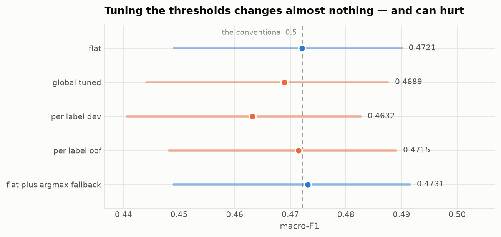
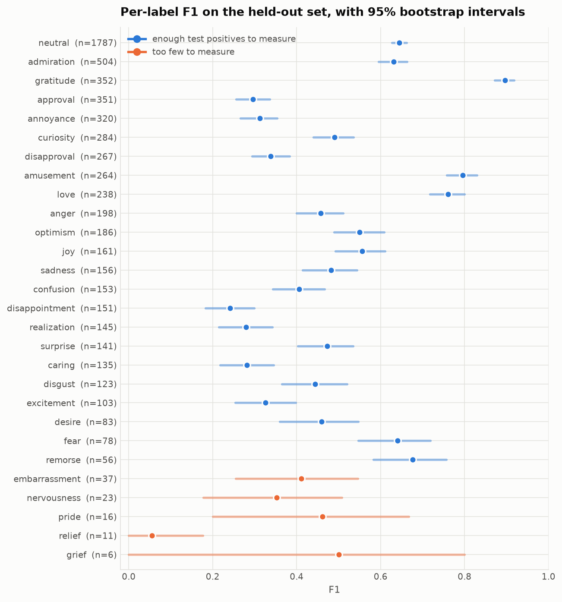
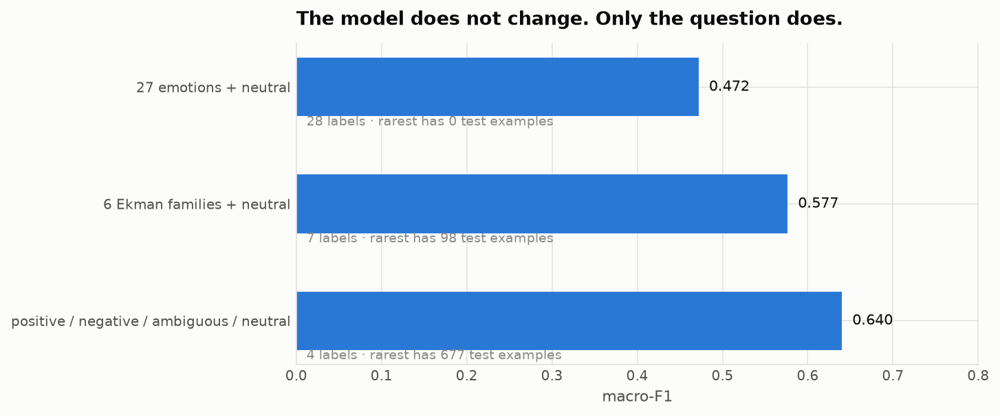
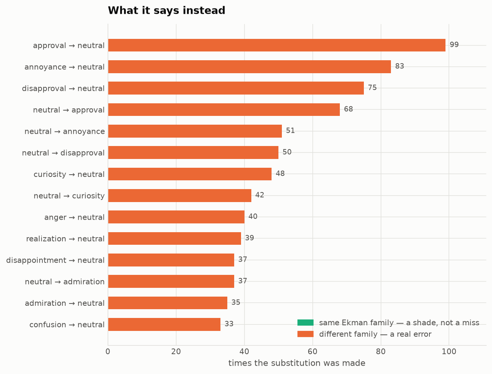
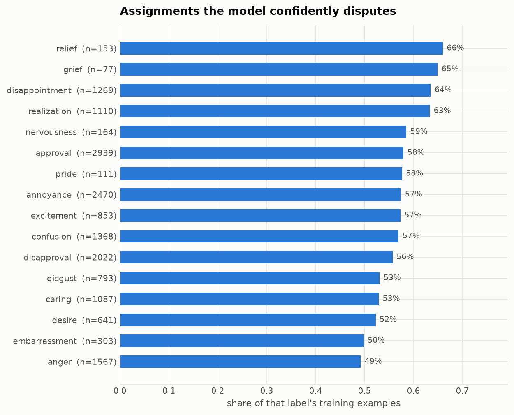
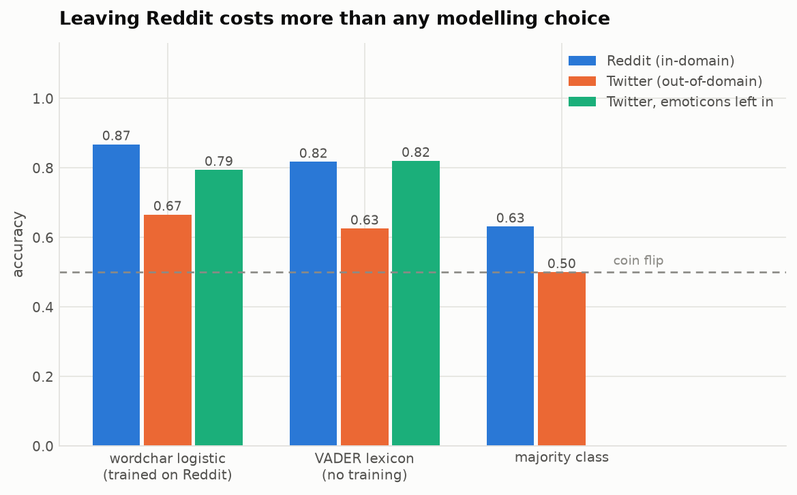
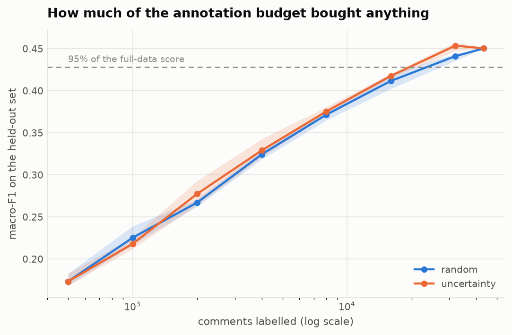

# Results

_Generated by `nuance report`. Every number comes from a file in `reports/`; nothing is transcribed by hand._

## Headline

- **macro-F1 0.4721 [0.4477, 0.4893]** on 5,427 held-out comments across 28 labels — an interval **0.042** wide.
- **micro-F1 0.5399 [0.5300, 0.5493]**.
- Only **23 of 28** labels have the 50+ held-out positives needed for a per-label score to be a measurement. Restricted to those, macro-F1 is **0.4973 [0.4856, 0.5086]** — higher, and with an interval **1.8x** tighter.
- The widest per-label interval belongs to `grief` (6 held-out examples): F1 0.500, 95% CI [0.000, 0.800].

## The model ladder

| model | macro_f1 | ci_low | ci_high | micro_f1 | seconds |
| --- | --- | --- | --- | --- | --- |
| prior | 0.0 | 0.0 | 0.0 | 0.0 | 0.9 |
| most_frequent | 0.0177 | 0.0172 | 0.0182 | 0.304 | 0.5 |
| word_logistic | 0.4504 | 0.4272 | 0.4687 | 0.5207 | 5.0 |
| wordchar_logistic | 0.4721 | 0.4477 | 0.4893 | 0.5399 | 11.8 |
| wordchar_logistic_unweighted | 0.3557 | 0.3361 | 0.3728 | 0.5005 | 11.8 |
| wordchar_svm | 0.4508 | 0.4251 | 0.4725 | 0.54 | 16.8 |

All at the conventional 0.5 threshold. A base-rate predictor scores exactly zero there, because no label's base rate reaches 0.5 — a reminder that 0.5 is a decision, not a neutral default.

### What is actually distinguishable

| comparison | a | b | difference | ci_low | ci_high | significant |
| --- | --- | --- | --- | --- | --- | --- |
| wordchar_logistic_vs_most_frequent | 0.4720818102359772 | 0.017693769186735153 | 0.4543880522251129 | 0.4312214232981205 | 0.47205008342862126 | True |
| wordchar_logistic_vs_word_logistic | 0.4720818102359772 | 0.4504064917564392 | 0.021675318479537964 | 0.01074182689189911 | 0.03308685645461082 | True |
| wordchar_logistic_vs_wordchar_svm | 0.4720818102359772 | 0.4507994055747986 | 0.02128240466117859 | 0.0033916674554347994 | 0.041018854081630696 | True |
| wordchar_logistic_vs_wordchar_logistic_unweighted | 0.4720818102359772 | 0.35568949580192566 | 0.11639231443405151 | 0.0927401378750801 | 0.138226543366909 | True |
| per_label_dev_vs_flat | 0.4631510376930237 | 0.4720818102359772 | -0.008930772542953491 | -0.02567475214600563 | 0.0059552706778049445 | False |
| per_label_oof_vs_flat | 0.4714910089969635 | 0.4720818102359772 | -0.0005908012390136719 | -0.010419078916311265 | 0.011801911145448684 | False |
| global_tuned_vs_flat | 0.4688873291015625 | 0.4720818102359772 | -0.003194481134414673 | -0.017169637233018877 | 0.006067696958780289 | False |

Paired on identical bootstrap resamples. This matters: the character-n-gram model and the word-only model have heavily overlapping individual intervals, and the paired test still separates them cleanly — because two systems scored on the same comments share most of their noise, and pairing cancels it.

## Threshold strategies

| strategy | macro_f1 | macro_f1_ci_low | macro_f1_ci_high | micro_f1 | fitted_on |
| --- | --- | --- | --- | --- | --- |
| flat | 0.4720818102359772 | 0.4490249365568161 | 0.4900478981435299 | 0.5399191975593567 | nothing (the convention) |
| global_tuned | 0.4688873291015625 | 0.44414074197411535 | 0.48758819326758385 | 0.5411486029624939 | dev split |
| per_label_dev | 0.4631510376930237 | 0.4406173199415207 | 0.48268011286854745 | 0.5381653904914856 | dev split |
| per_label_oof | 0.4714910089969635 | 0.4482147641479969 | 0.4890455976128578 | 0.5430437326431274 | out-of-fold training predictions |
| flat_plus_argmax_fallback | 0.4731305241584778 | 0.4489843711256981 | 0.49152199923992157 | 0.542587161064148 | nothing (every comment has >=1 label by construction) |

Tuning a threshold per label on the dev split — the standard recipe — comes out **-0.0089** against leaving every threshold at 0.5 (95% CI [-0.0257, +0.0060]). Cross-fitting the same tuning on out-of-fold training predictions, where the rare labels have several times more positives to tune on, recovers most of that: **-0.0006** (95% CI [-0.0104, +0.0118]).

Neither is distinguishable from doing nothing. The honest summary is that on this benchmark threshold tuning is a coin flip dressed as a method — and the version most people use is the one that lands on the wrong side of it.

## The scoreboard nobody prints

| label | support | precision | recall | f1 | f1_ci_low | f1_ci_high | measurable |
| --- | --- | --- | --- | --- | --- | --- | --- |
| grief | 6 | 0.5 | 0.5 | 0.5 | 0.0 | 0.8 | False |
| relief | 11 | 0.04 | 0.091 | 0.056 | 0.0 | 0.177 | False |
| pride | 16 | 0.6 | 0.375 | 0.462 | 0.2 | 0.667 | False |
| nervousness | 23 | 0.321 | 0.391 | 0.353 | 0.178 | 0.508 | False |
| embarrassment | 37 | 0.417 | 0.405 | 0.411 | 0.255 | 0.545 | False |
| remorse | 56 | 0.558 | 0.857 | 0.676 | 0.583 | 0.757 | True |
| fear | 78 | 0.577 | 0.718 | 0.64 | 0.546 | 0.718 | True |
| desire | 83 | 0.44 | 0.482 | 0.46 | 0.36 | 0.546 | True |
| excitement | 103 | 0.267 | 0.417 | 0.326 | 0.254 | 0.397 | True |
| disgust | 123 | 0.434 | 0.455 | 0.444 | 0.365 | 0.52 | True |

Median interval width: **0.330** for labels below the support threshold against **0.119** above it. These labels are not being scored badly; they are barely being scored.

## The same model, three taxonomies

| taxonomy | labels | rarest label | macro_f1 | micro_f1 |
| --- | --- | --- | --- | --- |
| 27 emotions + neutral | 28 | 6 | 0.4721 | 0.5399 |
| 6 Ekman families + neutral | 7 | 98 | 0.5765 | 0.6414 |
| positive / negative / ambiguous / neutral | 4 | 677 | 0.6403 | 0.6669 |

Identical predictions, scored against coarser questions. Nothing about the model changed.

## Where the errors land

- **19.7%** of substitutions stay inside the same Ekman family (479 of 2,437).
- **49.2%** involve `neutral` in one direction or the other.

So the fine-grained taxonomy is not the main difficulty. The hard boundary is whether a comment carries any emotion at all — which is exactly the judgement human annotators disagree about most.

| true | predicted_instead | count |
| --- | --- | --- |
| approval | neutral | 99 |
| annoyance | neutral | 83 |
| disapproval | neutral | 75 |
| neutral | approval | 68 |
| neutral | annoyance | 51 |
| neutral | disapproval | 50 |
| curiosity | neutral | 48 |
| neutral | curiosity | 42 |

## Are the labels even right?

Confident learning on out-of-fold predictions flags **300** assignments for review. Of the 'label probably missing' flags, **43%** name an emotion in the same Ekman family as one the comment already carries — a shade rather than an error.

| text | given_labels | label | kind |
| --- | --- | --- | --- |
| Lol!! | joy | amusement | label probably missing |
| I'm so sorry | sadness | remorse | label probably missing |
| i don't love love love it | disapproval | love | label probably missing |
| Why thank you | curiosity | gratitude | label probably missing |
| You are a sad person | neutral | sadness | label probably missing |
| Shame.. | neutral | embarrassment | label probably missing |

Dropping every implicated row — **14,685**, 34% of the training set — and retraining moves macro-F1 from 0.4721 to 0.4736: not distinguishable from noise. The audit earns its place by finding labels worth fixing, not by raising the score.

## Does it travel?

NLTK's tweet labels come from emoticons **still present in the text**: 97.8% of tweets are decidable from the emoticon alone, at 100% accuracy where the rule fires. Evaluating without stripping them measures emoticon detection.

| model | evaluated_on | emoticons | n | accuracy | f1 |
| --- | --- | --- | --- | --- | --- |
| wordchar logistic (trained on Reddit) | Reddit (in-domain) | nan | 3210 | 0.868 | 0.893 |
| wordchar logistic (trained on Reddit) | Twitter (out-of-domain) | stripped | 10000 | 0.666 | 0.697 |
| wordchar logistic (trained on Reddit) | Twitter (out-of-domain) | left in (leaky) | 10000 | 0.794 | 0.808 |
| VADER lexicon (no training) | Reddit (in-domain) | nan | 3210 | 0.817 | 0.862 |
| VADER lexicon (no training) | Twitter (out-of-domain) | stripped | 10000 | 0.625 | 0.709 |
| VADER lexicon (no training) | Twitter (out-of-domain) | left in (leaky) | 10000 | 0.82 | 0.841 |
| majority class | Reddit (in-domain) | nan | 3210 | 0.631 | 0.774 |
| majority class | Twitter (out-of-domain) | nan | 10000 | 0.5 | 0.667 |

## What the annotation budget bought

| strategy | full_data_macro_f1 | budget_reached | share_of_corpus |
| --- | --- | --- | --- |
| random | 0.4504 | 32000 | 0.7372 |
| uncertainty | 0.4504 | 32000 | 0.7372 |

Uncertainty sampling is indistinguishable from labelling at random here, and the curve is still climbing at the full 43,410 comments. On this problem more data would help more than cleverer selection of it.

