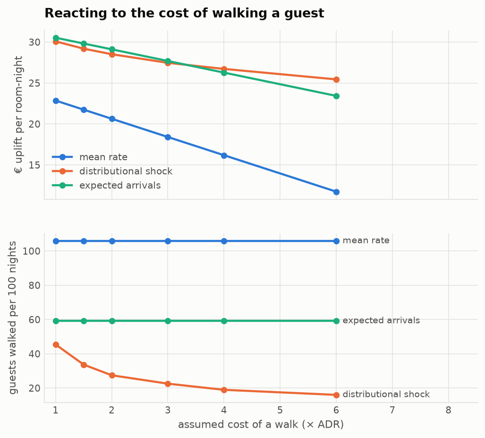
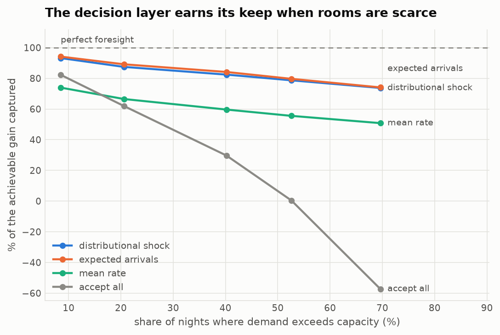
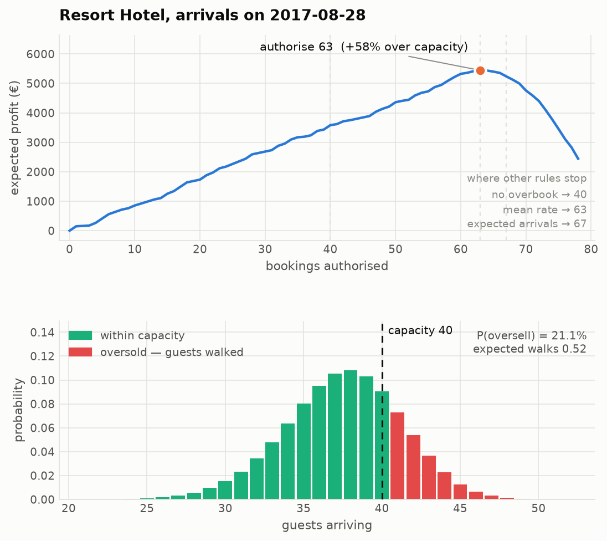

# Results

_Generated by `overbook report`. Every number here comes from a file in `reports/`; nothing is transcribed by hand._

## Headline

- Held-out period **2017-04-01 to 2017-08-31** — 306 hotel-nights across both properties, arrivals the model never saw. Demand exceeds capacity on **40%** of them.
- Cancellation model: **ROC-AUC 0.888**, **Brier 0.1355**, **ECE 0.0412**.
- Against the pooled-rate rule hotels actually use, the policy earns **+426 EUR per hotel-night** (95% CI +312 to +554; P(positive) = 1.00) — 82.05 vs 74.17 EUR per available room-night.
- It captures **82%** of everything a perfect-foresight oracle could capture, against 60% for the pooled rule.
- It does so while walking **27** guests per 100 nights instead of **106**, at **83.8%** occupancy.

### The result that did not go my way

Against `expected_arrivals` — the *same model*, with the decision collapsed to a mean instead of a distribution — the distributional policy is **-32 EUR per night** (95% CI -65 to +3), i.e. indistinguishable from zero and, at the default cost assumption, slightly behind.

Nearly all of the measured gain comes from **having calibrated per-booking probabilities at all**, not from the distributional optimiser on top of them. What the distribution buys is control rather than free money: it walks **27** guests per 100 nights against **59** for the mean-based rule, and unlike any mean-based rule it responds when the cost of a walk changes (next section). Above roughly 3x ADR it wins on profit too.

## Model quality

### The ladder

| model | roc_auc | pr_auc | brier | log_loss | ece | bias_ratio |
| --- | --- | --- | --- | --- | --- | --- |
| prior | 0.5 | 0.4116 | 0.2446 | 0.6827 | 0.0703 | 0.8799 |
| logistic | 0.8788 | 0.8426 | 0.1459 | 0.4349 | 0.0658 | 0.8446 |
| lightgbm | 0.8893 | 0.8511 | 0.1467 | 0.439 | 0.1008 | 0.8205 |

_Test window, before calibration — this table isolates the model._

### The value of waiting

| information set | roc_auc | brier | ece |
| --- | --- | --- | --- |
| booking_time | 0.8853 | 0.147 | 0.0914 |
| arrival_eve | 0.8893 | 0.1467 | 0.1008 |

`booking_time` uses only what was known when the reservation was made; `arrival_eve` adds what accrued while it sat on the books. The overbooking decision lives in the second setting.

### Rolling-origin cross-validation (training window)

| fold | valid_from | valid_to | n_valid | roc_auc | brier | ece |
| --- | --- | --- | --- | --- | --- | --- |
| 1 | 2015-10-19 | 2016-02-05 | 9623 | 0.9155 | 0.0781 | 0.0485 |
| 2 | 2016-02-06 | 2016-05-25 | 18119 | 0.9076 | 0.1217 | 0.0633 |
| 3 | 2016-05-26 | 2016-09-12 | 17933 | 0.8906 | 0.1408 | 0.0975 |
| 4 | 2016-09-13 | 2016-12-31 | 17880 | 0.909 | 0.1433 | 0.1278 |

Mean ROC-AUC 0.9057 (sd 0.0106) over 4 folds.

### Calibration

| metric | raw | calibrated (isotonic) |
| --- | --- | --- |
| brier | 0.14667 | 0.13549 |
| log_loss | 0.43901 | 0.40076 |
| ece | 0.10077 | 0.04124 |
| mce | 0.26375 | 0.10661 |
| bias_ratio | 0.82047 | 0.89987 |

Calibration barely touches ranking — ROC-AUC moves 0.8893 → 0.8883, and the small loss is isotonic regression mapping distinct scores onto equal ones rather than any real degradation. The gain is that the numbers the decision layer multiplies by euros now mean what they say.

#### Refreshing the calibrator as outcomes arrive

| metric | frozen calibrator | refreshed monthly |
| --- | --- | --- |
| brier | 0.13549 | 0.13378 |
| ece | 0.04124 | 0.02621 |
| bias_ratio | 0.89987 | 0.94632 |
| mean_pred | 0.37042 | 0.38955 |

The cancellation rate climbs from 41.2% in the evaluation window against a calibrator fitted on a 33.5% window, so a frozen map under-predicts cancellations. Refitting on arrivals that have already resolved — information a hotel genuinely has — cuts calibration error by about half. No future data is used.

## The decision

Capacity is inferred from training arrivals at the 70% quantile — **City Hotel: 68 rooms**, **Resort Hotel: 40 rooms** — a regime where demand exceeds capacity on 40% of nights.
Contribution margin = ADR x 0.75; cost of walking a guest = ADR x 2.0.
Shared nightly shock estimated on the validation window: **tau = 0.0699** — night-level arrivals are about twice as dispersed as independence implies.

| policy | mean_authorised | occupancy | walks_per_100_nights | nights_oversold_pct | profit_per_room_night | uplift_pct | pct_of_oracle_gap_closed |
| --- | --- | --- | --- | --- | --- | --- | --- |
| oracle | 83.742 | 0.889 | 0.0 | 0.0 | 88.136 | 64.645 | 100.0 |
| expected_arrivals | 82.556 | 0.86 | 59.15 | 12.745 | 82.642 | 54.381 | 84.123 |
| distributional | 80.931 | 0.843 | 32.353 | 6.536 | 82.246 | 53.641 | 82.977 |
| distributional_shock | 80.539 | 0.838 | 27.451 | 5.882 | 82.047 | 53.27 | 82.404 |
| mean_rate | 76.242 | 0.792 | 105.882 | 16.013 | 74.167 | 38.549 | 59.631 |
| fixed_25pct | 64.889 | 0.672 | 11.765 | 3.922 | 66.036 | 23.36 | 36.136 |
| accept_all | 90.948 | 0.889 | 552.288 | 40.196 | 63.792 | 19.168 | 29.652 |
| fixed_15pct | 60.402 | 0.622 | 2.288 | 1.634 | 61.39 | 14.681 | 22.711 |
| fixed_10pct | 58.271 | 0.599 | 0.0 | 0.0 | 59.174 | 10.541 | 16.306 |
| fixed_05pct | 55.595 | 0.567 | 0.0 | 0.0 | 56.082 | 4.766 | 7.372 |
| no_overbook | 53.337 | 0.541 | 0.0 | 0.0 | 53.531 | 0.0 | 0.0 |

### Uplift over doing nothing, with uncertainty

| policy | mean_uplift_per_night | ci_low | ci_high | p_positive |
| --- | --- | --- | --- | --- |
| oracle | 1868.69 | 1709.73 | 2034.26 | 1.0 |
| expected_arrivals | 1571.99 | 1416.72 | 1734.67 | 1.0 |
| distributional | 1550.59 | 1400.47 | 1708.83 | 1.0 |
| distributional_shock | 1539.87 | 1392.48 | 1696.85 | 1.0 |
| mean_rate | 1114.32 | 974.67 | 1255.12 | 1.0 |
| fixed_25pct | 675.27 | 619.7 | 726.73 | 1.0 |
| accept_all | 554.1 | 263.62 | 827.59 | 1.0 |
| fixed_15pct | 424.39 | 391.83 | 455.45 | 1.0 |
| fixed_10pct | 304.72 | 279.63 | 328.59 | 1.0 |
| fixed_05pct | 137.76 | 125.51 | 149.53 | 1.0 |

2,000 bootstrap resamples over nights — nights, not bookings, because every booking on one night shares a single decision.

### Head to head

| policy | baseline | mean_uplift_per_night | ci_low | ci_high | p_positive |
| --- | --- | --- | --- | --- | --- |
| distributional_shock | mean_rate | 425.55 | 311.98 | 554.33 | 1.0 |
| distributional_shock | expected_arrivals | -32.13 | -65.49 | 3.46 | 0.04 |
| distributional_shock | accept_all | 985.77 | 744.37 | 1239.93 | 1.0 |

### Reacting to the cost of failure

| walk_cost_multiplier | policy | uplift_per_room_night | walks_per_100_nights |
| --- | --- | --- | --- |
| 1.0 | expected_arrivals | 30.53 | 59.15 |
| 1.0 | distributional_shock | 30.08 | 45.42 |
| 1.0 | mean_rate | 22.86 | 105.88 |
| 1.5 | expected_arrivals | 29.82 | 59.15 |
| 1.5 | distributional_shock | 29.19 | 33.66 |
| 1.5 | mean_rate | 21.75 | 105.88 |
| 2.0 | expected_arrivals | 29.11 | 59.15 |
| 2.0 | distributional_shock | 28.52 | 27.45 |
| 2.0 | mean_rate | 20.64 | 105.88 |
| 3.0 | expected_arrivals | 27.69 | 59.15 |
| 3.0 | distributional_shock | 27.46 | 22.55 |
| 3.0 | mean_rate | 18.41 | 105.88 |
| 4.0 | distributional_shock | 26.72 | 18.95 |
| 4.0 | expected_arrivals | 26.27 | 59.15 |
| 4.0 | mean_rate | 16.19 | 105.88 |
| 6.0 | distributional_shock | 25.44 | 16.01 |
| 6.0 | expected_arrivals | 23.43 | 59.15 |
| 6.0 | mean_rate | 11.74 | 105.88 |

The walk rate of a mean-based rule is **flat** across this sweep: it has no mechanism to care. The distributional policy tightens as the penalty grows, which is the property you actually want in a revenue system.

### When does any of this matter?

| capacity_quantile | binds_pct_of_nights | policy | uplift_per_room_night | walks_per_100_nights | pct_of_oracle_gap_closed |
| --- | --- | --- | --- | --- | --- |
| 0.5 | 69.6 | expected_arrivals | 31.0 | 100.3 | 74.1 |
| 0.5 | 69.6 | distributional_shock | 30.8 | 44.4 | 73.7 |
| 0.5 | 69.6 | mean_rate | 21.2 | 128.1 | 50.8 |
| 0.5 | 69.6 | accept_all | -24.0 | 1162.1 | -57.3 |
| 0.6 | 52.6 | expected_arrivals | 30.7 | 81.0 | 79.7 |
| 0.6 | 52.6 | distributional_shock | 30.3 | 35.6 | 78.7 |
| 0.6 | 52.6 | mean_rate | 21.4 | 115.7 | 55.5 |
| 0.6 | 52.6 | accept_all | 0.1 | 782.0 | 0.4 |
| 0.7 | 40.2 | expected_arrivals | 29.1 | 59.2 | 84.1 |
| 0.7 | 40.2 | distributional_shock | 28.5 | 27.5 | 82.4 |
| 0.7 | 40.2 | mean_rate | 20.6 | 105.9 | 59.6 |
| 0.7 | 40.2 | accept_all | 10.3 | 552.3 | 29.7 |
| 0.8 | 20.6 | expected_arrivals | 24.3 | 38.2 | 89.1 |
| 0.8 | 20.6 | distributional_shock | 23.8 | 20.6 | 87.4 |
| 0.8 | 20.6 | mean_rate | 18.1 | 72.2 | 66.5 |
| 0.8 | 20.6 | accept_all | 16.9 | 284.6 | 61.9 |
| 0.9 | 8.5 | expected_arrivals | 16.0 | 14.7 | 94.1 |
| 0.9 | 8.5 | distributional_shock | 15.8 | 9.2 | 93.2 |
| 0.9 | 8.5 | accept_all | 14.0 | 108.8 | 82.3 |
| 0.9 | 8.5 | mean_rate | 12.6 | 40.8 | 73.9 |

With loose capacity every policy converges on 'accept everything' and the decision layer is theatre. As rooms get scarce the naive rules fall apart — `accept_all` goes **negative** once demand exceeds capacity on most nights — while the calibrated policies hold. That is the regime the default config targets.

## An example night

`Resort Hotel`, arrivals on `2017-08-28` — 78 bookings on the books against 40 rooms.

- `authorised`: 63.000
- `overbook_pct`: 57.500
- `expected_arrivals`: 37.481
- `p_oversell`: 0.211
- `expected_walks`: 0.522
- `expected_unsold`: 3.041
- `expected_profit`: 5,444.095

## Drift

| feature | kind | psi | band |
| --- | --- | --- | --- |
| arrival_month | numeric | 7.466 | major shift |
| arrival_weekofyear | numeric | 6.406 | major shift |
| arrival_dayofyear | numeric | 6.268 | major shift |
| hotel_cancel_rate_90d | numeric | 2.073 | major shift |
| hotel_cancel_rate_28d | numeric | 1.596 | major shift |
| agent | categorical | 0.821 | major shift |
| adr | numeric | 0.77 | major shift |
| adr_per_night | numeric | 0.77 | major shift |

PSI between the training and held-out windows. This is a real out-of-distribution test: trained on 2015-2016 arrivals, scored on 2017 arrivals, with the cancellation rate itself trending upward across the gap.
